# Implementación de Creación Atómica: Customer/Supplier con Person

## 📋 Resumen

Este documento describe la implementación de la funcionalidad de **creación atómica** que permite crear un `Customer` o `Supplier` junto con su `Person` asociada en una sola operación transaccional, manteniendo la consistencia de datos y siguiendo los principios de Clean Architecture.

## 🎯 Objetivo

Refactorizar la lógica de creación para que al crear un `Customer` o `Supplier`, se cree automáticamente el `Person` asociado en una sola operación atómica, eliminando la necesidad de crear primero el `Person` y luego usar su ID.

## 🏗️ Arquitectura

### Capas Involucradas

```
┌─────────────────────────────────────────────────────────────┐
│                    INFRASTRUCTURE LAYER                     │
├─────────────────────────────────────────────────────────────┤
│ Controllers: CustomerController, SupplierController         │
│ Repositories: PersonPrismaRepository, CustomerPrismaRepo,   │
│               SupplierPrismaRepository, StorePrismaRepo     │
│ Services: PrismaService (transacciones)                    │
└─────────────────────────────────────────────────────────────┘
                                │
┌─────────────────────────────────────────────────────────────┐
│                    APPLICATION LAYER                        │
├─────────────────────────────────────────────────────────────┤
│ Services: CustomerService, SupplierService                  │
│ Use Cases: CreateCustomerWithPersonUseCase,                 │
│           CreateSupplierWithPersonUseCase                   │
│ DTOs: CreateCustomerWithPersonDto, CreateSupplierWithPersonDto │
│       CustomerWithPersonResponseDto, SupplierWithPersonResponseDto │
│ Mappers: CustomerMapper, SupplierMapper                     │
└─────────────────────────────────────────────────────────────┘
                                │
┌─────────────────────────────────────────────────────────────┐
│                      DOMAIN LAYER                           │
├─────────────────────────────────────────────────────────────┤
│ Entities: Person, Customer, Supplier, Store                 │
│ Repositories: PersonRepository, CustomerRepository,         │
│              SupplierRepository, StoreRepository            │
│ Value Objects: Document, Email, Phone                       │
│ Enums: DocumentType, EntityStatus                           │
└─────────────────────────────────────────────────────────────┘
```

## 🔧 Implementación

### 1. DTOs de Entrada

#### CreateCustomerWithPersonDto
```typescript
export class CreateCustomerWithPersonDto {
  @IsEnum(DocumentType)
  @ApiProperty({ enum: DocumentType, description: 'Tipo de documento' })
  documentType: DocumentType;

  @IsValidDocumentNumber()
  @ApiProperty({ description: 'Número de documento' })
  documentNumber: string;

  @IsString()
  @MinLength(2)
  @MaxLength(100)
  @Matches(/^[a-zA-ZáéíóúÁÉÍÓÚñÑ\s]+$/)
  @ApiProperty({ description: 'Nombres completos' })
  names: string;

  @IsOptional()
  @IsString()
  @MinLength(2)
  @MaxLength(200)
  @Matches(/^[a-zA-ZáéíóúÁÉÍÓÚñÑ\s.,&-]+$/)
  @ApiProperty({ description: 'Razón social', required: false })
  legalName?: string;

  @IsOptional()
  @IsString()
  @MinLength(10)
  @MaxLength(200)
  @ApiProperty({ description: 'Dirección', required: false })
  address?: string;

  @IsString()
  @Matches(/^\+51[0-9]{9}$/)
  @ApiProperty({ description: 'Teléfono en formato +51XXXXXXXXX' })
  phone: string;

  @IsEmail()
  @ApiProperty({ description: 'Correo electrónico' })
  email: string;

  @IsUUID()
  @ApiProperty({ description: 'ID de la tienda' })
  storeId: string;
}
```

#### CreateSupplierWithPersonDto
```typescript
// Estructura idéntica a CreateCustomerWithPersonDto
export class CreateSupplierWithPersonDto {
  // ... mismos campos que CreateCustomerWithPersonDto
}
```

### 2. DTOs de Respuesta

#### CustomerWithPersonResponseDto
```typescript
export class CustomerWithPersonResponseDto extends CustomerResponseDto {
  @ApiProperty({ description: 'Datos de la persona asociada' })
  person: PersonDataDto;
}

export class PersonDataDto {
  @ApiProperty({ description: 'ID único de la persona' })
  id: string;

  @ApiProperty({ enum: DocumentType, description: 'Tipo de documento' })
  documentType: DocumentType;

  @ApiProperty({ description: 'Número de documento' })
  documentNumber: string;

  @ApiProperty({ description: 'Nombres completos' })
  names: string;

  @ApiProperty({ description: 'Razón social', required: false })
  legalName?: string;

  @ApiProperty({ description: 'Dirección', required: false })
  address?: string;

  @ApiProperty({ description: 'Teléfono' })
  phone: string;

  @ApiProperty({ description: 'Correo electrónico' })
  email: string;

  @ApiProperty({ enum: EntityStatus, description: 'Estado de la entidad' })
  status: EntityStatus;

  @ApiProperty({ description: 'Fecha de creación' })
  createdAt: Date;

  @ApiProperty({ description: 'Fecha de actualización' })
  updatedAt: Date;
}
```

### 3. Use Cases

#### CreateCustomerWithPersonUseCase
```typescript
@Injectable()
export class CreateCustomerWithPersonUseCase {
  constructor(
    private readonly personRepository: PersonRepository,
    private readonly customerRepository: CustomerRepository,
    private readonly storeRepository: StoreRepository,
    private readonly prismaService: PrismaService,
  ) {}

  async execute(dto: CreateCustomerWithPersonDto): Promise<CustomerWithPersonResponseDto> {
    return await this.prismaService.$transaction(async (tx) => {
      // 1. Verificar que la tienda existe
      const store = await this.storeRepository.findById(dto.storeId);
      if (!store) {
        throw new StoreNotFoundError(dto.storeId);
      }

      // 2. Verificar que no exista Person con el mismo documento
      const existingPerson = await this.personRepository.findByDocumentNumber(
        dto.documentNumber,
        tx
      );
      
      if (existingPerson) {
        throw new PersonAlreadyExistsError('documentNumber', dto.documentNumber);
      }

      // 3. Verificar que no exista Customer para esta tienda y documento
      const existingCustomer = await this.customerRepository.findByStoreAndDocument(
        dto.storeId,
        dto.documentNumber,
        tx
      );
      
      if (existingCustomer) {
        throw new CustomerAlreadyExistsError(dto.storeId, dto.documentNumber);
      }

      // 4. Crear Person
      const personId = crypto.randomUUID();
      const person = Person.create(
        personId,
        dto.documentType,
        dto.documentNumber,
        dto.names,
        dto.legalName,
        dto.address,
        dto.phone,
        dto.email
      );

      const savedPerson = await this.personRepository.createWithTransaction(person, tx);

      // 5. Crear Customer
      const customerId = crypto.randomUUID();
      const customer = Customer.create(
        customerId,
        dto.storeId,
        savedPerson.id
      );

      const savedCustomer = await this.customerRepository.createWithTransaction(customer, tx);

      // 6. Retornar DTO de respuesta con datos de Person incluidos
      return CustomerMapper.toResponseDtoWithPerson(savedCustomer, savedPerson);
    });
  }
}
```

### 4. Validaciones Personalizadas

#### IsValidDocumentNumber Validator
```typescript
export function IsValidDocumentNumber(validationOptions?: ValidationOptions) {
  return function (object: Object, propertyName: string) {
    registerDecorator({
      name: 'isValidDocumentNumber',
      target: object.constructor,
      propertyName: propertyName,
      options: validationOptions,
      validator: {
        validate(value: any, args: ValidationArguments) {
          const obj = args.object as any;
          const documentType = obj.documentType;
          
          if (!documentType || !value) return false;
          
          const patterns = {
            DNI: /^[0-9]{8}$/,
            RUC: /^[0-9]{11}$/,
            CE: /^[0-9]{9}$/,
            PASSPORT: /^[A-Z0-9]{6,12}$/
          };
          
          const pattern = patterns[documentType];
          return pattern ? pattern.test(value) : false;
        },
        defaultMessage(args: ValidationArguments) {
          return 'El formato del número de documento no es válido para el tipo seleccionado';
        }
      }
    });
  };
}
```

### 5. Endpoints

#### POST /customers/with-person
```typescript
@Post('with-person')
@ApiOperation({ 
  summary: 'Crear cliente con persona asociada',
  description: 'Crea un nuevo cliente junto con su persona asociada en una sola operación atómica'
})
@ApiBody({ type: CreateCustomerWithPersonDto })
@ApiResponse({ 
  status: 201, 
  description: 'Cliente creado exitosamente',
  type: CustomerWithPersonResponseDto 
})
@ApiResponse({ 
  status: 400, 
  description: 'Datos de entrada inválidos',
  type: ValidationErrorResponseDto 
})
@ApiResponse({ 
  status: 404, 
  description: 'Tienda no encontrada',
  type: ErrorResponseDto 
})
@ApiResponse({ 
  status: 409, 
  description: 'Persona o cliente ya existe',
  type: ErrorResponseDto 
})
async createCustomerWithPerson(
  @Body() dto: CreateCustomerWithPersonDto
): Promise<CustomerWithPersonResponseDto> {
  return this.customerService.createCustomerWithPerson(dto);
}
```

#### POST /suppliers/with-person
```typescript
@Post('with-person')
@ApiOperation({ 
  summary: 'Crear proveedor con persona asociada',
  description: 'Crea un nuevo proveedor junto con su persona asociada en una sola operación atómica'
})
@ApiBody({ type: CreateSupplierWithPersonDto })
@ApiResponse({ 
  status: 201, 
  description: 'Proveedor creado exitosamente',
  type: SupplierWithPersonResponseDto 
})
// ... mismas respuestas que Customer
async createSupplierWithPerson(
  @Body() dto: CreateSupplierWithPersonDto
): Promise<SupplierWithPersonResponseDto> {
  return this.supplierService.createSupplierWithPerson(dto);
}
```

## 🔍 Validaciones Implementadas

### 1. Validaciones de Entrada
- **DocumentType**: Debe ser un valor válido del enum
- **DocumentNumber**: Formato específico según el tipo de documento
- **Names**: Mínimo 2 caracteres, máximo 100, solo letras y espacios
- **LegalName**: Opcional, mínimo 2 caracteres, máximo 200
- **Address**: Opcional, mínimo 10 caracteres, máximo 200
- **Phone**: Formato +51XXXXXXXXX (9 dígitos después del +51)
- **Email**: Formato de email válido
- **StoreId**: Debe ser un UUID válido

### 2. Validaciones de Negocio
- **Store existe**: Verifica que la tienda especificada existe
- **Person única**: No puede existir otra persona con el mismo documento
- **Customer/Supplier único**: No puede existir otro cliente/proveedor para la misma tienda y documento

### 3. Validaciones de Transacción
- **Atomicidad**: Si falla cualquier operación, se hace rollback completo
- **Consistencia**: Los datos se mantienen consistentes en todo momento
- **Aislamiento**: Las transacciones no interfieren entre sí

## 📊 Códigos de Error

| Código | HTTP Status | Descripción |
|--------|-------------|-------------|
| `VALIDATION_ERROR` | 400 | Datos de entrada inválidos |
| `STORE_NOT_FOUND` | 404 | Tienda no encontrada |
| `PERSON_ALREADY_EXISTS` | 409 | Ya existe una persona con ese documento |
| `CUSTOMER_ALREADY_EXISTS` | 409 | Ya existe un cliente para esa tienda y documento |
| `SUPPLIER_ALREADY_EXISTS` | 409 | Ya existe un proveedor para esa tienda y documento |

## 🧪 Ejemplos de Uso

### Crear Customer con Person
```bash
curl -X POST http://localhost:3000/customers/with-person \
  -H "Content-Type: application/json" \
  -d '{
    "documentType": "DNI",
    "documentNumber": "12345678",
    "names": "Juan Carlos Pérez",
    "legalName": "Juan Carlos Pérez S.A.C.",
    "address": "Av. Principal 123, Lima",
    "phone": "+51987654321",
    "email": "juan@example.com",
    "storeId": "7770b3ec-ac36-4718-bd1a-68e4179073e1"
  }'
```

### Respuesta Exitosa
```json
{
  "id": "cbb91f0b-affd-4638-a53f-2295d5bcbd8e",
  "storeId": "7770b3ec-ac36-4718-bd1a-68e4179073e1",
  "personId": "10661c5b-4304-4582-ae8a-9d2e0cf88955",
  "status": "ACTIVE",
  "registeredAt": "2025-10-18T16:17:56.716Z",
  "updatedAt": "2025-10-18T16:17:56.716Z",
  "person": {
    "id": "10661c5b-4304-4582-ae8a-9d2e0cf88955",
    "documentType": "DNI",
    "documentNumber": "12345678",
    "names": "Juan Carlos Pérez",
    "legalName": "Juan Carlos Pérez S.A.C.",
    "address": "Av. Principal 123, Lima",
    "phone": "+51987654321",
    "email": "juan@example.com",
    "status": "ACTIVE",
    "createdAt": "2025-10-18T16:17:56.715Z",
    "updatedAt": "2025-10-18T16:17:56.715Z"
  }
}
```

### Error de Validación
```json
{
  "code": "VALIDATION_ERROR",
  "message": "Datos de entrada inválidos",
  "statusCode": 400,
  "timestamp": "2025-10-18T16:18:07.733Z",
  "path": "/customers/with-person",
  "errors": [
    "El formato del número de documento no es válido para el tipo seleccionado",
    "Los nombres deben tener al menos 2 caracteres",
    "El formato del email no es válido"
  ]
}
```

### Error de Tienda No Encontrada
```json
{
  "code": "STORE_NOT_FOUND",
  "message": "Tienda con ID 550e8400-e29b-41d4-a716-446655440000 no encontrada",
  "statusCode": 404,
  "timestamp": "2025-10-18T16:21:20.571Z",
  "path": "/customers/with-person",
  "isOperational": true
}
```

## 🔄 Flujo de Transacción

```mermaid
graph TD
    A[Cliente envía request] --> B[Validar DTO]
    B --> C[Iniciar transacción Prisma]
    C --> D[Verificar que Store existe]
    D --> E{Store existe?}
    E -->|No| F[Lanzar StoreNotFoundError]
    E -->|Sí| G[Verificar Person duplicada]
    G --> H{Person existe?}
    H -->|Sí| I[Lanzar PersonAlreadyExistsError]
    H -->|No| J[Verificar Customer/Supplier duplicado]
    J --> K{Customer/Supplier existe?}
    K -->|Sí| L[Lanzar Customer/SupplierAlreadyExistsError]
    K -->|No| M[Crear Person]
    M --> N[Crear Customer/Supplier]
    N --> O[Commit transacción]
    O --> P[Retornar respuesta enriquecida]
    F --> Q[Rollback transacción]
    I --> Q
    L --> Q
    Q --> R[Retornar error]
```



## 📊 Flujo de Datos

```mermaid
graph LR
    subgraph "Cliente/Frontend"
        A[HTTP Request<br/>POST /customers/with-person]
        B[CreateCustomerWithPersonDto<br/>{documentType, documentNumber, names, ...}]
    end
    
    subgraph "Infrastructure Layer"
        C[CustomerController<br/>@Post('with-person')]
        D[CustomerService<br/>createCustomerWithPerson()]
        E[CreateCustomerWithPersonUseCase<br/>execute()]
        F[PrismaService<br/>$transaction()]
    end
    
    subgraph "Application Layer"
        G[DTO Validation<br/>class-validator]
        H[StoreRepository<br/>findById()]
        I[PersonRepository<br/>findByDocumentNumber()]
        J[CustomerRepository<br/>findByStoreAndDocument()]
        K[PersonRepository<br/>createWithTransaction()]
        L[CustomerRepository<br/>createWithTransaction()]
        M[CustomerMapper<br/>toResponseDtoWithPerson()]
    end
    
    subgraph "Domain Layer"
        N[Store Entity<br/>Validación de existencia]
        O[Person Entity<br/>Creación y validación]
        P[Customer Entity<br/>Creación y validación]
        Q[Value Objects<br/>Document, Email, Phone]
    end
    
    subgraph "Database Layer"
        R[(PostgreSQL<br/>Prisma ORM)]
        S[Store Table]
        T[Person Table]
        U[Customer Table]
    end
    
    subgraph "Response"
        V[CustomerWithPersonResponseDto<br/>{id, storeId, personId, person: {...}}]
        W[HTTP Response<br/>201 Created]
    end
    
    A --> B
    B --> C
    C --> D
    D --> E
    E --> F
    F --> G
    G --> H
    H --> I
    I --> J
    J --> K
    K --> L
    L --> M
    
    H --> N
    I --> O
    J --> P
    K --> O
    L --> P
    
    N --> Q
    O --> Q
    P --> Q
    
    H --> R
    I --> R
    J --> R
    K --> R
    L --> R
    
    R --> S
    R --> T
    R --> U
    
    M --> V
    V --> W
    
    style A fill:#e1f5fe
    style B fill:#e8f5e8
    style C fill:#fff3e0
    style D fill:#fff3e0
    style E fill:#fff3e0
    style F fill:#fff3e0
    style G fill:#f3e5f5
    style H fill:#f3e5f5
    style I fill:#f3e5f5
    style J fill:#f3e5f5
    style K fill:#f3e5f5
    style L fill:#f3e5f5
    style M fill:#f3e5f5
    style N fill:#e8f5e8
    style O fill:#e8f5e8
    style P fill:#e8f5e8
    style Q fill:#e8f5e8
    style R fill:#ffebee
    style S fill:#ffebee
    style T fill:#ffebee
    style U fill:#ffebee
    style V fill:#e1f5fe
    style W fill:#e1f5fe
```

### 📋 Descripción del Flujo de Datos

#### **1. Entrada (Cliente → Infrastructure)**
- **HTTP Request**: Cliente envía `POST /customers/with-person`
- **DTO**: Datos se mapean a `CreateCustomerWithPersonDto`
- **Controller**: `CustomerController` recibe y valida el request

#### **2. Procesamiento (Application Layer)**
- **Service**: `CustomerService` delega al use case
- **Use Case**: `CreateCustomerWithPersonUseCase` ejecuta la lógica de negocio
- **Transacción**: `PrismaService.$transaction()` asegura atomicidad

#### **3. Validaciones (Application → Domain)**
- **Store**: Verifica existencia via `StoreRepository.findById()`
- **Person**: Verifica duplicados via `PersonRepository.findByDocumentNumber()`
- **Customer**: Verifica duplicados via `CustomerRepository.findByStoreAndDocument()`

#### **4. Creación (Domain → Database)**
- **Person**: Crea entidad `Person` y persiste via `PersonRepository.createWithTransaction()`
- **Customer**: Crea entidad `Customer` y persiste via `CustomerRepository.createWithTransaction()`
- **Transacción**: Ambas operaciones dentro de la misma transacción Prisma

#### **5. Respuesta (Database → Cliente)**
- **Mapper**: `CustomerMapper.toResponseDtoWithPerson()` combina datos
- **DTO**: Genera `CustomerWithPersonResponseDto` enriquecido
- **HTTP Response**: Retorna `201 Created` con datos completos

### 🔄 Flujo de Datos Detallado por Capa

#### **Infrastructure Layer (Controladores)**
```typescript
// 1. Recibe HTTP Request
@Post('with-person')
async createCustomerWithPerson(@Body() dto: CreateCustomerWithPersonDto)

// 2. Delega al Service
return this.customerService.createCustomerWithPerson(dto);
```

#### **Application Layer (Servicios y Use Cases)**
```typescript
// 3. Service delega al Use Case
async createCustomerWithPerson(dto: CreateCustomerWithPersonDto) {
  return this.createCustomerWithPersonUseCase.execute(dto);
}

// 4. Use Case ejecuta lógica de negocio
async execute(dto: CreateCustomerWithPersonDto) {
  return await this.prismaService.$transaction(async (tx) => {
    // Validaciones y creación...
  });
}
```

#### **Domain Layer (Entidades y Repositorios)**
```typescript
// 5. Validaciones de negocio
const store = await this.storeRepository.findById(dto.storeId);
const existingPerson = await this.personRepository.findByDocumentNumber(dto.documentNumber, tx);

// 6. Creación de entidades
const person = Person.create(personId, dto.documentType, dto.documentNumber, ...);
const customer = Customer.create(customerId, dto.storeId, savedPerson.id);
```

#### **Database Layer (Persistencia)**
```typescript
// 7. Persistencia atómica
const savedPerson = await this.personRepository.createWithTransaction(person, tx);
const savedCustomer = await this.customerRepository.createWithTransaction(customer, tx);
```

### 🎯 Puntos Clave del Flujo

1. **Separación de Responsabilidades**: Cada capa tiene su función específica
2. **Inversión de Dependencias**: Los use cases dependen de interfaces, no implementaciones
3. **Transacciones Atómicas**: Toda la operación se ejecuta en una sola transacción
4. **Validaciones Múltiples**: DTO, negocio y base de datos
5. **Mapeo de Datos**: Conversión entre DTOs y entidades de dominio
6. **Respuesta Enriquecida**: Combina datos de Customer y Person en una sola respuesta

## 🏛️ Principios de Clean Architecture

### 1. Separación de Responsabilidades
- **Domain**: Entidades, value objects, enums
- **Application**: Use cases, DTOs, mappers, servicios
- **Infrastructure**: Repositorios, controladores, base de datos

### 2. Inversión de Dependencias
- Los use cases dependen de interfaces del dominio
- Las implementaciones concretas se inyectan en la infraestructura

### 3. Independencia de Frameworks
- El dominio no conoce Prisma ni NestJS
- Las transacciones se manejan a través de interfaces

### 4. Testabilidad
- Cada capa puede ser probada independientemente
- Los use cases pueden ser probados con mocks

## 🚀 Beneficios

### 1. **Atomicidad**
- Operación todo-o-nada
- Consistencia de datos garantizada
- Rollback automático en caso de error

### 2. **Simplicidad de Uso**
- Un solo endpoint para crear Customer/Supplier + Person
- No necesidad de manejar IDs intermedios
- Respuesta enriquecida con todos los datos

### 3. **Validaciones Robustas**
- Validaciones a nivel de DTO
- Validaciones de negocio en use cases
- Mensajes de error específicos y claros

### 4. **Mantenibilidad**
- Código organizado por capas
- Responsabilidades bien definidas
- Fácil de extender y modificar

## 🔧 Configuración de Módulos

### CustomerModule
```typescript
@Module({
  controllers: [CustomerController],
  providers: [
    CustomerService,
    PrismaService,
    { provide: 'CustomerRepository', useClass: CustomerPrismaRepository },
    { provide: 'PersonRepository', useClass: PersonPrismaRepository },
    { provide: 'StoreRepository', useClass: StorePrismaRepository },
  ],
  exports: [CustomerService, 'CustomerRepository', 'PersonRepository', 'StoreRepository'],
})
export class CustomerModule {}
```

### SupplierModule
```typescript
@Module({
  controllers: [SupplierController],
  providers: [
    SupplierService,
    PrismaService,
    { provide: 'SupplierRepository', useClass: SupplierPrismaRepository },
    { provide: 'PersonRepository', useClass: PersonPrismaRepository },
    { provide: 'StoreRepository', useClass: StorePrismaRepository },
  ],
  exports: [SupplierService, 'SupplierRepository', 'PersonRepository', 'StoreRepository'],
})
export class SupplierModule {}
```

## 📝 Notas Importantes

1. **Compatibilidad**: Los endpoints originales (`POST /customers`, `POST /suppliers`) siguen funcionando
2. **Transacciones**: Se usa `$transaction` de Prisma para garantizar atomicidad
3. **Validaciones**: Se mantienen todas las validaciones existentes más las nuevas
4. **Performance**: Las validaciones se ejecutan en el orden más eficiente
5. **Logs**: Los errores se registran automáticamente por el Global Exception Filter

## 🔮 Futuras Mejoras

1. **Cache**: Implementar cache para validaciones de Store
2. **Batch**: Crear endpoints para creación masiva
3. **Audit**: Agregar logs de auditoría para transacciones
4. **Metrics**: Implementar métricas de performance
5. **Retry**: Agregar lógica de reintento para fallos transitorios

---

**Fecha de creación**: 18 de Octubre de 2025  
**Versión**: 1.0  
**Autor**: Equipo de Desarrollo Backend Inventory
