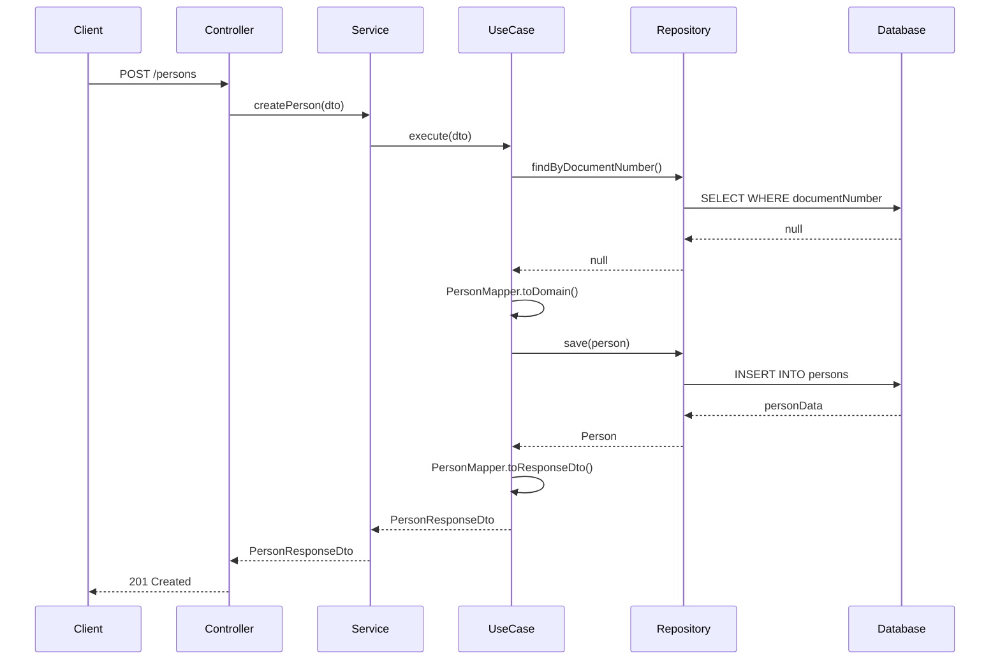
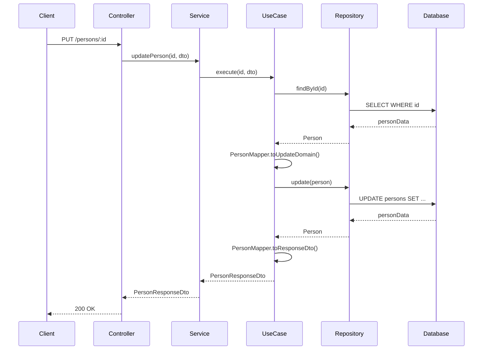
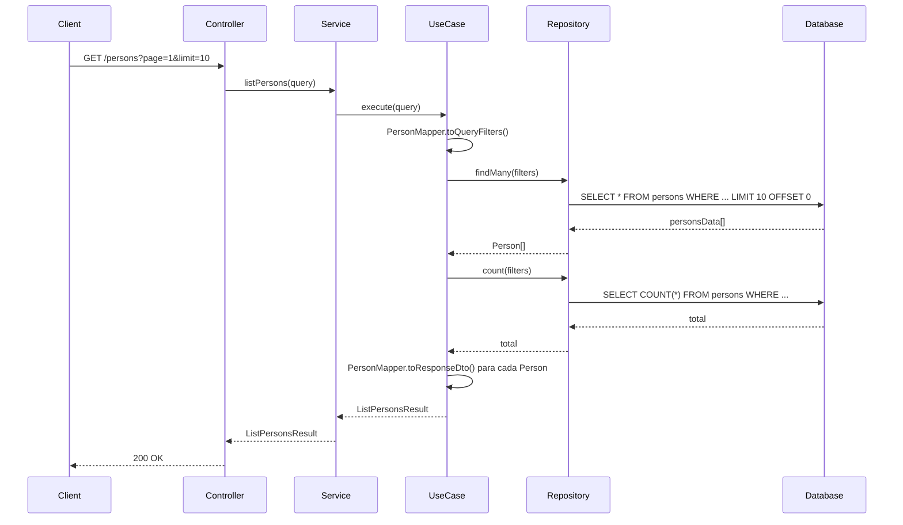
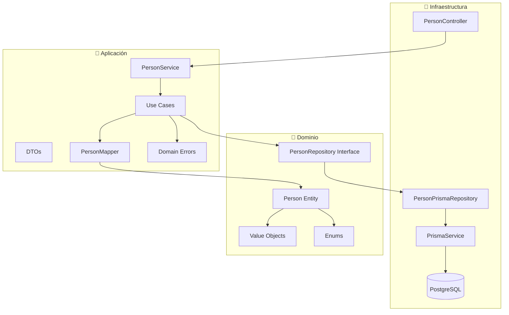
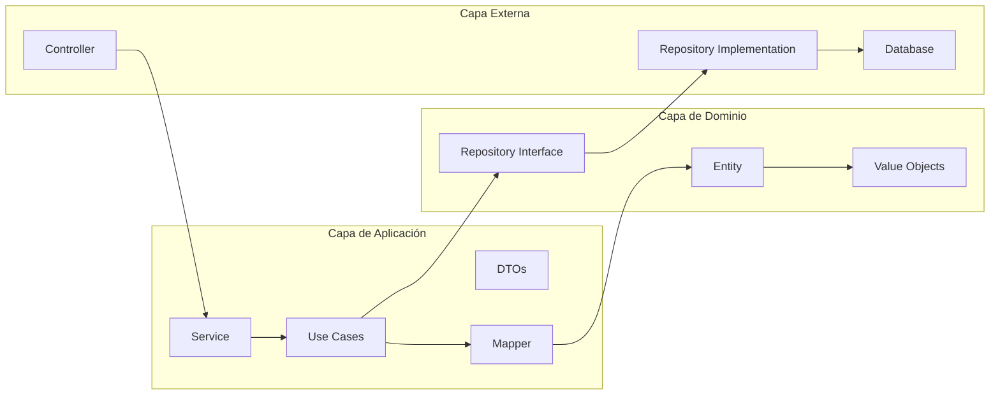

# 📋 Guía Completa de Implementación de Person en Clean Architecture

## 📖 Índice
1. [Introducción](#introducción)
2. [Arquitectura General](#arquitectura-general)
3. [Capa de Dominio](#capa-de-dominio)
4. [Capa de Aplicación](#capa-de-aplicación)
5. [Capa de Infraestructura](#capa-de-infraestructura)
6. [Flujo de Datos](#flujo-de-datos)
7. [Diagramas de Arquitectura](#diagramas-de-arquitectura)
8. [Ejemplos de Uso](#ejemplos-de-uso)
9. [Mejores Prácticas](#mejores-prácticas)

---

## 🎯 Introducción

Esta guía documenta la implementación completa del módulo **Person** siguiendo los principios de **Clean Architecture**. El módulo gestiona personas físicas y jurídicas con validaciones robustas, manejo de estados y operaciones CRUD completas.

### Características Principales
- ✅ **Clean Architecture** con separación clara de capas
- ✅ **Value Objects** para validaciones de dominio
- ✅ **Use Cases** específicos para cada operación
- ✅ **Soft Delete** para preservar integridad de datos
- ✅ **Validaciones** robustas en todas las capas
- ✅ **Documentación API** con Swagger
- ✅ **Manejo de errores** centralizado

---

## 🏗️ Arquitectura General

### Estructura de Capas

```
src/
├── domain/           # 🎯 Capa de Dominio (Entidades, Value Objects, Enums)
├── application/      # 🔧 Capa de Aplicación (Use Cases, Servicios, DTOs)
└── infrastructure/   # 🔌 Capa de Infraestructura (Controladores, Repositorios, DB)
```

### Principios Aplicados
- **Regla de Dependencia**: Las dependencias fluyen hacia adentro
- **Inversión de Dependencias**: Uso de interfaces y abstracciones
- **Separación de Responsabilidades**: Cada capa tiene un propósito específico
- **Encapsulación**: Lógica de negocio en entidades de dominio

---

## 🎯 Capa de Dominio

### 📁 Estructura
```
src/domain/
├── entities/
│   └── person.entity.ts          # Entidad principal
├── value-objects/
│   ├── document.value-object.ts  # Validación de documentos
│   ├── email.value-object.ts     # Validación de emails
│   └── phone.value-object.ts     # Validación de teléfonos
├── enums/
│   ├── document-type.enum.ts     # Tipos de documento
│   └── entity-status.enum.ts     # Estados de entidad
└── repositories/
    └── person.repository.ts      # Interfaz del repositorio
```

### 🏛️ Entidad Person

**Archivo**: `src/domain/entities/person.entity.ts`

```typescript
export class Person {
  private constructor(
    private readonly _id: string,
    private readonly _document: Document,
    private _names: string,
    private _legalName: string | null,
    private _address: string | null,
    private _phone: Phone | null,
    private _email: Email | null,
    private _status: EntityStatus,
    private readonly _createdAt: Date,
    private _updatedAt: Date
  ) {}
}
```

#### Características Principales

1. **Inmutabilidad Parcial**
   - ID y documento son inmutables
   - Otros campos pueden actualizarse mediante métodos específicos

2. **Factory Methods**
   - `create()`: Para crear nuevas personas
   - `fromPersistence()`: Para reconstruir desde base de datos

3. **Métodos de Negocio**
   - `updateNames()`, `updateAddress()`, etc.
   - `activate()`, `deactivate()`, `suspend()`, `delete()`
   - `isActive()`, `isDeleted()`

4. **Validaciones Encapsuladas**
   - Cada método valida sus propias reglas de negocio
   - Actualización automática de `updatedAt`

### 🎯 Value Objects

#### Document Value Object
**Archivo**: `src/domain/value-objects/document.value-object.ts`

```typescript
export class Document {
  constructor(type: DocumentType, number: string) {
    this.validateDocument(type, number);
    this._type = type;
    this._number = number;
  }
}
```

**Validaciones**:
- DNI: 8 dígitos
- RUC: 11 dígitos
- CE: 7-9 caracteres
- Pasaporte: 6-12 caracteres

#### Email Value Object
**Archivo**: `src/domain/value-objects/email.value-object.ts`

```typescript
export class Email {
  constructor(email: string) {
    this.validateEmail(email);
    this._value = email.toLowerCase().trim();
  }
}
```

**Validaciones**:
- Formato de email válido
- Máximo 254 caracteres
- Normalización automática

#### Phone Value Object
**Archivo**: `src/domain/value-objects/phone.value-object.ts`

```typescript
export class Phone {
  constructor(phone: string) {
    this.validatePhone(phone);
    this._value = phone;
  }
}
```

**Validaciones**:
- Solo números y símbolo +
- Longitud entre 7-15 dígitos
- Limpieza de caracteres especiales

### 📋 Enums

#### DocumentType
```typescript
export enum DocumentType {
  DNI = 'DNI',       // Documento Nacional de Identidad
  RUC = 'RUC',       // Registro Único de Contribuyentes
  CE = 'CE',         // Carné de Extranjería
  PASSPORT = 'PASSPORT' // Pasaporte
}
```

#### EntityStatus
```typescript
export enum EntityStatus {
  ACTIVE = 'ACTIVE',     // Activo
  INACTIVE = 'INACTIVE', // Inactivo
  SUSPENDED = 'SUSPENDED', // Suspendido
  DELETED = 'DELETED'    // Eliminado
}
```

### 🔌 Interfaz del Repositorio

**Archivo**: `src/domain/repositories/person.repository.ts`

```typescript
export interface PersonRepository {
  findById(id: string): Promise<Person | null>;
  findByDocumentNumber(documentNumber: string): Promise<Person | null>;
  findByEmail(email: string): Promise<Person | null>;
  findMany(filters?: PersonQueryFilters): Promise<Person[]>;
  save(person: Person): Promise<Person>;
  update(person: Person): Promise<Person>;
  delete(id: string): Promise<void>;
  exists(id: string): Promise<boolean>;
  count(filters?: PersonQueryFilters): Promise<number>;
}
```

---

## 🔧 Capa de Aplicación

### 📁 Estructura
```
src/application/
├── use-cases/person/
│   ├── create-person.use-case.ts
│   ├── update-person.use-case.ts
│   ├── get-person-by-id.use-case.ts
│   ├── get-person-by-document.use-case.ts
│   ├── list-persons.use-case.ts
│   ├── change-person-status.use-case.ts
│   └── delete-person.use-case.ts
├── services/
│   └── person.service.ts
├── dto/person/
│   ├── create-person.dto.ts
│   ├── update-person.dto.ts
│   ├── person-response.dto.ts
│   ├── person-query.dto.ts
│   └── change-person-status.dto.ts
├── mappers/
│   └── person.mapper.ts
└── errors/
    └── domain-errors.ts
```

### 🎯 Use Cases

#### CreatePersonUseCase
**Archivo**: `src/application/use-cases/person/create-person.use-case.ts`

```typescript
export class CreatePersonUseCase {
  constructor(private readonly personRepository: PersonRepository) {}

  async execute(dto: CreatePersonDto): Promise<PersonResponseDto> {
    // 1. Verificar unicidad de documento
    const existingPerson = await this.personRepository.findByDocumentNumber(dto.documentNumber);
    if (existingPerson) {
      throw new PersonAlreadyExistsError('número de documento', dto.documentNumber);
    }

    // 2. Verificar unicidad de email (si se proporciona)
    if (dto.email) {
      const existingEmail = await this.personRepository.findByEmail(dto.email);
      if (existingEmail) {
        throw new PersonAlreadyExistsError('email', dto.email);
      }
    }

    // 3. Crear entidad
    const id = crypto.randomUUID();
    const person = PersonMapper.toDomain(dto, id);

    // 4. Guardar
    const savedPerson = await this.personRepository.save(person);

    // 5. Retornar DTO
    return PersonMapper.toResponseDto(savedPerson);
  }
}
```

#### UpdatePersonUseCase
**Archivo**: `src/application/use-cases/person/update-person.use-case.ts`

```typescript
export class UpdatePersonUseCase {
  async execute(id: string, dto: UpdatePersonDto): Promise<PersonResponseDto> {
    // 1. Buscar persona existente
    const existingPerson = await this.personRepository.findById(id);
    if (!existingPerson) {
      throw new PersonNotFoundError(id);
    }

    // 2. Verificar que no esté eliminada
    if (existingPerson.isDeleted()) {
      throw new PersonDeletedError(id);
    }

    // 3. Verificar email único si se actualiza
    if (dto.email && dto.email !== existingPerson.email?.value) {
      const existingEmail = await this.personRepository.findByEmail(dto.email);
      if (existingEmail && existingEmail.id !== id) {
        throw new PersonAlreadyExistsError('email', dto.email);
      }
    }

    // 4. Aplicar actualizaciones
    const updatedPerson = PersonMapper.toUpdateDomain(dto, existingPerson);

    // 5. Guardar y retornar
    const savedPerson = await this.personRepository.update(updatedPerson);
    return PersonMapper.toResponseDto(savedPerson);
  }
}
```

#### ListPersonsUseCase
**Archivo**: `src/application/use-cases/person/list-persons.use-case.ts`

```typescript
export class ListPersonsUseCase {
  async execute(query: PersonQueryDto): Promise<ListPersonsResult> {
    const filters = PersonMapper.toQueryFilters(query);
    
    // Obtener datos paginados
    const persons = await this.personRepository.findMany(filters);
    const total = await this.personRepository.count(filters);

    // Convertir a DTOs
    const data = persons.map(person => PersonMapper.toResponseDto(person));

    // Calcular metadatos de paginación
    const page = query.page || 1;
    const limit = query.limit || 10;
    const totalPages = Math.ceil(total / limit);

    return { data, total, page, limit, totalPages };
  }
}
```

### 🎯 Servicio de Aplicación

**Archivo**: `src/application/services/person.service.ts`

```typescript
export class PersonService {
  private readonly createPersonUseCase: CreatePersonUseCase;
  private readonly updatePersonUseCase: UpdatePersonUseCase;
  // ... otros use cases

  constructor(@Inject('PersonRepository') personRepository: PersonRepository) {
    this.createPersonUseCase = new CreatePersonUseCase(personRepository);
    this.updatePersonUseCase = new UpdatePersonUseCase(personRepository);
    // ... inicializar otros use cases
  }

  async createPerson(dto: CreatePersonDto): Promise<PersonResponseDto> {
    return this.createPersonUseCase.execute(dto);
  }

  async updatePerson(id: string, dto: UpdatePersonDto): Promise<PersonResponseDto> {
    return this.updatePersonUseCase.execute(id, dto);
  }
  // ... otros métodos
}
```

### 📝 DTOs (Data Transfer Objects)

#### CreatePersonDto
```typescript
export class CreatePersonDto {
  @IsEnum(DocumentType)
  documentType: DocumentType;

  @IsString()
  @MinLength(6)
  @MaxLength(12)
  documentNumber: string;

  @IsString()
  @MinLength(2)
  @MaxLength(100)
  names: string;

  @IsOptional()
  @IsString()
  @MaxLength(100)
  legalName?: string;

  // ... otros campos
}
```

#### PersonResponseDto
```typescript
export class PersonResponseDto {
  @ApiProperty()
  id: string;

  @ApiProperty({ enum: DocumentType })
  documentType: DocumentType;

  @ApiProperty()
  documentNumber: string;

  @ApiProperty()
  names: string;

  @ApiPropertyOptional()
  legalName: string | null;

  // ... otros campos
}
```

#### PersonQueryDto
```typescript
export class PersonQueryDto {
  @IsOptional()
  @IsEnum(DocumentType)
  documentType?: DocumentType;

  @IsOptional()
  @IsEnum(EntityStatus)
  status?: EntityStatus;

  @IsOptional()
  @IsString()
  @MaxLength(100)
  search?: string;

  @IsOptional()
  @Type(() => Number)
  @IsNumber()
  @Min(1)
  @Max(1000)
  page?: number;

  // ... otros campos de paginación
}
```

### 🔄 Mapper

**Archivo**: `src/application/mappers/person.mapper.ts`

```typescript
export class PersonMapper {
  // DTO → Entidad
  static toDomain(dto: CreatePersonDto, id: string): Person {
    return Person.create(
      id,
      dto.documentType,
      dto.documentNumber,
      dto.names,
      dto.legalName,
      dto.address,
      dto.phone,
      dto.email
    );
  }

  // Entidad → DTO de respuesta
  static toResponseDto(person: Person): PersonResponseDto {
    return {
      id: person.id,
      documentType: person.document.type,
      documentNumber: person.document.number,
      names: person.names,
      legalName: person.legalName,
      address: person.address,
      phone: person.phone?.value || null,
      email: person.email?.value || null,
      status: person.status,
      createdAt: person.createdAt,
      updatedAt: person.updatedAt,
    };
  }

  // Aplicar actualizaciones a entidad existente
  static toUpdateDomain(dto: UpdatePersonDto, existingPerson: Person): Person {
    if (!this.validateUpdateDto(dto)) {
      throw new Error('No hay campos válidos para actualizar');
    }

    if (dto.names !== undefined) {
      existingPerson.updateNames(dto.names);
    }
    if (dto.legalName !== undefined) {
      existingPerson.updateLegalName(dto.legalName);
    }
    // ... otros campos

    return existingPerson;
  }

  // Validar DTO de actualización
  static validateUpdateDto(dto: UpdatePersonDto): boolean {
    const fields = Object.keys(dto) as (keyof UpdatePersonDto)[];
    return fields.some(field => {
      const value = dto[field];
      return value !== undefined && value !== null && value !== '';
    });
  }
}
```

### ⚠️ Errores de Dominio

**Archivo**: `src/application/errors/domain-errors.ts`

```typescript
export abstract class DomainError extends Error {
  abstract readonly code: string;
  abstract readonly statusCode: number;
  abstract readonly isOperational: boolean;
}

export class PersonNotFoundError extends DomainError {
  readonly code = 'PERSON_NOT_FOUND';
  readonly statusCode = 404;
  readonly isOperational = true;
}

export class PersonAlreadyExistsError extends DomainError {
  readonly code = 'PERSON_ALREADY_EXISTS';
  readonly statusCode = 409;
  readonly isOperational = true;
}

export class PersonDeletedError extends DomainError {
  readonly code = 'PERSON_DELETED';
  readonly statusCode = 410;
  readonly isOperational = true;
}
```

---

## 🔌 Capa de Infraestructura

### 📁 Estructura
```
src/infrastructure/
├── controllers/
│   └── person.controller.ts
├── repositories/
│   └── person.repository.ts
├── modules/
│   ├── person.module.ts
│   └── database.module.ts
├── database/
│   └── prisma.service.ts
└── filters/
    └── global-exception.filter.ts
```

### 🎮 Controlador

**Archivo**: `src/infrastructure/controllers/person.controller.ts`

```typescript
@ApiTags('persons')
@Controller('persons')
export class PersonController {
  constructor(private readonly personService: PersonService) {}

  @Post()
  @HttpCode(HttpStatus.CREATED)
  @ApiOperation({ summary: 'Crear una nueva persona' })
  @ApiResponse({ status: 201, description: 'Persona creada exitosamente' })
  async createPerson(@Body() createPersonDto: CreatePersonDto): Promise<PersonResponseDto> {
    return this.personService.createPerson(createPersonDto);
  }

  @Get(':id')
  @ApiOperation({ summary: 'Obtener persona por ID' })
  @ApiParam({ name: 'id', description: 'ID único de la persona' })
  async getPersonById(@Param('id') id: string): Promise<PersonResponseDto | null> {
    return this.personService.getPersonById(id);
  }

  @Get()
  @ApiOperation({ summary: 'Listar personas con filtros y paginación' })
  async listPersons(@Query() query: PersonQueryDto): Promise<ListPersonsResult> {
    return this.personService.listPersons(query);
  }

  @Put(':id')
  @ApiOperation({ summary: 'Actualizar datos de una persona' })
  async updatePerson(
    @Param('id') id: string,
    @Body() updatePersonDto: UpdatePersonDto,
  ): Promise<PersonResponseDto> {
    return this.personService.updatePerson(id, updatePersonDto);
  }

  @Put(':id/status')
  @ApiOperation({ summary: 'Cambiar estado de una persona' })
  async changePersonStatus(
    @Param('id') id: string,
    @Body() changeStatusDto: ChangePersonStatusDto,
  ): Promise<PersonResponseDto> {
    return this.personService.changePersonStatus(id, changeStatusDto);
  }

  @Delete(':id')
  @HttpCode(HttpStatus.NO_CONTENT)
  @ApiOperation({ summary: 'Eliminar una persona (soft delete)' })
  async deletePerson(@Param('id') id: string): Promise<PersonResponseDto> {
    return this.personService.deletePerson(id);
  }
}
```

### 🗄️ Repositorio de Infraestructura

**Archivo**: `src/infrastructure/repositories/person.repository.ts`

```typescript
@Injectable()
export class PersonPrismaRepository implements PersonRepository {
  constructor(private readonly prisma: PrismaService) {}

  async findById(id: string): Promise<Person | null> {
    const personData = await this.prisma.person.findUnique({
      where: { id },
    });

    if (!personData) {
      return null;
    }

    return Person.fromPersistence(
      personData.id,
      personData.documentType as DocumentType,
      personData.documentNumber,
      personData.names,
      personData.legalName,
      personData.address,
      personData.phone,
      personData.email,
      personData.status as EntityStatus,
      personData.createdAt,
      personData.updatedAt
    );
  }

  async findByDocumentNumber(documentNumber: string): Promise<Person | null> {
    const personData = await this.prisma.person.findUnique({
      where: { documentNumber },
    });

    if (!personData) {
      return null;
    }

    return Person.fromPersistence(/* ... */);
  }

  async findMany(filters: PersonQueryDto): Promise<Person[]> {
    const where: any = {};

    if (filters.documentType) {
      where.documentType = filters.documentType;
    }

    if (filters.status) {
      where.status = filters.status;
    }

    if (filters.search) {
      where.OR = [
        { names: { contains: filters.search, mode: 'insensitive' } },
        { documentNumber: { contains: filters.search } },
        { legalName: { contains: filters.search, mode: 'insensitive' } },
      ];
    }

    const personsData = await this.prisma.person.findMany({
      where,
      skip: filters.offset || 0,
      take: filters.limit || 10,
      orderBy: {
        [filters.sortBy || 'createdAt']: filters.sortOrder || 'desc',
      },
    });

    return personsData.map(personData =>
      Person.fromPersistence(/* ... */)
    );
  }

  async save(person: Person): Promise<Person> {
    const personData = await this.prisma.person.create({
      data: {
        id: person.id,
        documentType: person.document.type,
        documentNumber: person.document.number,
        names: person.names,
        legalName: person.legalName,
        address: person.address,
        phone: person.phone?.value || null,
        email: person.email?.value || null,
        status: person.status,
        createdAt: person.createdAt,
        updatedAt: person.updatedAt,
      },
    });

    return Person.fromPersistence(/* ... */);
  }

  async update(person: Person): Promise<Person> {
    const personData = await this.prisma.person.update({
      where: { id: person.id },
      data: {
        names: person.names,
        legalName: person.legalName,
        address: person.address,
        phone: person.phone?.value || null,
        email: person.email?.value || null,
        status: person.status,
        updatedAt: person.updatedAt,
      },
    });

    return Person.fromPersistence(/* ... */);
  }

  async delete(id: string): Promise<void> {
    await this.prisma.person.delete({
      where: { id },
    });
  }

  async exists(id: string): Promise<boolean> {
    const count = await this.prisma.person.count({
      where: { id },
    });
    return count > 0;
  }

  async count(filters: Partial<PersonQueryDto>): Promise<number> {
    const where: any = {};

    if (filters.documentType) {
      where.documentType = filters.documentType;
    }

    if (filters.status) {
      where.status = filters.status;
    }

    if (filters.search) {
      where.OR = [
        { names: { contains: filters.search, mode: 'insensitive' } },
        { documentNumber: { contains: filters.search } },
        { legalName: { contains: filters.search, mode: 'insensitive' } },
      ];
    }

    return this.prisma.person.count({ where });
  }
}
```

### 🏗️ Módulos

#### PersonModule
**Archivo**: `src/infrastructure/modules/person.module.ts`

```typescript
@Module({
  controllers: [PersonController],
  providers: [
    PersonService,
    PrismaService,
    {
      provide: 'PersonRepository',
      useClass: PersonPrismaRepository,
    },
  ],
  exports: [PersonService, 'PersonRepository'],
})
export class PersonModule {}
```

#### DatabaseModule
**Archivo**: `src/infrastructure/modules/database.module.ts`

```typescript
@Module({
  providers: [PrismaService],
  exports: [PrismaService],
})
export class DatabaseModule {}
```

### 🗃️ Servicio de Base de Datos

**Archivo**: `src/infrastructure/database/prisma.service.ts`

```typescript
@Injectable()
export class PrismaService extends PrismaClient implements OnModuleInit {
  async onModuleInit() {
    await this.$connect();
  }
}
```

### ⚠️ Filtro Global de Excepciones

**Archivo**: `src/infrastructure/filters/global-exception.filter.ts`

```typescript
@Catch()
export class GlobalExceptionFilter implements ExceptionFilter {
  catch(exception: unknown, host: ArgumentsHost): void {
    const ctx = host.switchToHttp();
    const response = ctx.getResponse<Response>();
    const request = ctx.getRequest<Request>();

    let errorResponse: ErrorResponseDto | ValidationErrorDto;
    let status: number;

    if (exception instanceof DomainError) {
      // Errores de dominio personalizados
      status = exception.statusCode;
      errorResponse = {
        code: exception.code,
        message: exception.message,
        statusCode: exception.statusCode,
        timestamp: new Date().toISOString(),
        path: request.url,
        isOperational: exception.isOperational,
      };
    } else if (exception instanceof HttpException) {
      // Errores HTTP de NestJS
      status = exception.getStatus();
      // ... manejo de errores HTTP
    } else {
      // Errores no controlados
      status = HttpStatus.INTERNAL_SERVER_ERROR;
      // ... manejo de errores internos
    }

    response.status(status).json(errorResponse);
  }
}
```

---

## 🔄 Flujo de Datos

### 1. Crear Persona



### 2. Actualizar Persona



### 3. Listar Personas



---

## 📊 Diagramas de Arquitectura

### Arquitectura de Capas



### Flujo de Dependencias



---

## 🚀 Ejemplos de Uso

### 1. Crear una Persona Física

```bash
curl -X POST http://localhost:9987/persons \
  -H "Content-Type: application/json" \
  -d '{
    "documentType": "DNI",
    "documentNumber": "12345678",
    "names": "Juan Carlos Pérez García",
    "address": "Av. Principal 123, Lima, Perú",
    "phone": "+51987654321",
    "email": "juan.perez@email.com"
  }'
```

**Respuesta**:
```json
{
  "id": "123e4567-e89b-12d3-a456-426614174000",
  "documentType": "DNI",
  "documentNumber": "12345678",
  "names": "Juan Carlos Pérez García",
  "legalName": null,
  "address": "Av. Principal 123, Lima, Perú",
  "phone": "+51987654321",
  "email": "juan.perez@email.com",
  "status": "ACTIVE",
  "createdAt": "2024-01-15T10:30:00.000Z",
  "updatedAt": "2024-01-15T10:30:00.000Z"
}
```

### 2. Crear una Persona Jurídica

```bash
curl -X POST http://localhost:9987/persons \
  -H "Content-Type: application/json" \
  -d '{
    "documentType": "RUC",
    "documentNumber": "20123456789",
    "names": "María González",
    "legalName": "Empresa ABC S.A.C.",
    "address": "Av. Comercial 456, Lima, Perú",
    "phone": "+51987654322",
    "email": "contacto@empresaabc.com"
  }'
```

### 3. Listar Personas con Filtros

```bash
curl "http://localhost:9987/persons?page=1&limit=10&status=ACTIVE&search=Juan"
```

**Respuesta**:
```json
{
  "data": [
    {
      "id": "123e4567-e89b-12d3-a456-426614174000",
      "documentType": "DNI",
      "documentNumber": "12345678",
      "names": "Juan Carlos Pérez García",
      "legalName": null,
      "address": "Av. Principal 123, Lima, Perú",
      "phone": "+51987654321",
      "email": "juan.perez@email.com",
      "status": "ACTIVE",
      "createdAt": "2024-01-15T10:30:00.000Z",
      "updatedAt": "2024-01-15T10:30:00.000Z"
    }
  ],
  "total": 1,
  "page": 1,
  "limit": 10,
  "totalPages": 1
}
```

### 4. Actualizar Persona

```bash
curl -X PUT http://localhost:9987/persons/123e4567-e89b-12d3-a456-426614174000 \
  -H "Content-Type: application/json" \
  -d '{
    "names": "Juan Carlos Pérez García",
    "address": "Av. Principal 456, Lima, Perú",
    "phone": "+51987654323"
  }'
```

### 5. Cambiar Estado

```bash
curl -X PUT http://localhost:9987/persons/123e4567-e89b-12d3-a456-426614174000/status \
  -H "Content-Type: application/json" \
  -d '{
    "status": "INACTIVE",
    "reason": "Solicitud del cliente"
  }'
```

### 6. Eliminar Persona (Soft Delete)

```bash
curl -X DELETE http://localhost:9987/persons/123e4567-e89b-12d3-a456-426614174000
```

---

## ✅ Mejores Prácticas

### 1. **Validaciones por Capas**
- **Dominio**: Validaciones de negocio en entidades y value objects
- **Aplicación**: Validaciones de casos de uso específicos
- **Infraestructura**: Validaciones de entrada con class-validator

### 2. **Manejo de Errores**
- Errores de dominio específicos y descriptivos
- Códigos de error consistentes
- Filtro global para manejo centralizado

### 3. **Inmutabilidad**
- Value objects inmutables
- Entidades con campos inmutables donde corresponde
- Factory methods para creación controlada

### 4. **Separación de Responsabilidades**
- Cada use case tiene una responsabilidad específica
- Mappers para conversión entre capas
- Servicios como orquestadores de use cases

### 5. **Testabilidad**
- Interfaces para repositorios
- Inyección de dependencias
- Métodos pequeños y enfocados

### 6. **Documentación**
- Swagger para API
- Comentarios en código
- Guías de implementación

---

## 🔧 Configuración de Base de Datos

### Schema Prisma

```prisma
model Person {
  id              String   @id @default(uuid())
  documentType    DocumentType @map("document_type")
  documentNumber  String   @unique @map("document_number")
  names           String
  legalName       String?  @map("legal_name")
  address         String?
  phone           String?
  email           String?
  status          EntityStatus @default(ACTIVE)
  createdAt       DateTime @default(now()) @map("created_at")
  updatedAt       DateTime @updatedAt @map("updated_at")
  
  @@index([documentNumber])
  @@index([status])
  @@map("persons")
}

enum DocumentType {
  DNI
  RUC
  CE
  PASSPORT
}

enum EntityStatus {
  ACTIVE
  INACTIVE
  SUSPENDED
  DELETED
}
```

### Migración

```sql
-- CreateTable
CREATE TABLE "persons" (
    "id" TEXT NOT NULL,
    "document_type" "DocumentType" NOT NULL,
    "document_number" TEXT NOT NULL,
    "names" TEXT NOT NULL,
    "legal_name" TEXT,
    "address" TEXT,
    "phone" TEXT,
    "email" TEXT,
    "status" "EntityStatus" NOT NULL DEFAULT 'ACTIVE',
    "created_at" TIMESTAMP(3) NOT NULL DEFAULT CURRENT_TIMESTAMP,
    "updated_at" TIMESTAMP(3) NOT NULL,

    CONSTRAINT "persons_pkey" PRIMARY KEY ("id")
);

-- CreateIndex
CREATE UNIQUE INDEX "persons_document_number_key" ON "persons"("document_number");

-- CreateIndex
CREATE INDEX "persons_document_number_idx" ON "persons"("document_number");

-- CreateIndex
CREATE INDEX "persons_status_idx" ON "persons"("status");
```

---

## 📈 Métricas y Monitoreo

### Endpoints Disponibles

| Método | Endpoint | Descripción |
|--------|----------|-------------|
| POST | `/persons` | Crear persona |
| GET | `/persons/:id` | Obtener persona por ID |
| GET | `/persons/document/:documentNumber` | Obtener persona por documento |
| GET | `/persons` | Listar personas con filtros |
| PUT | `/persons/:id` | Actualizar persona |
| PUT | `/persons/:id/status` | Cambiar estado |
| DELETE | `/persons/:id` | Eliminar persona (soft delete) |

### Códigos de Error

| Código | Descripción |
|--------|-------------|
| `PERSON_NOT_FOUND` | Persona no encontrada |
| `PERSON_ALREADY_EXISTS` | Persona ya existe |
| `PERSON_DELETED` | Persona eliminada |
| `INVALID_DOCUMENT` | Documento inválido |
| `INVALID_EMAIL` | Email inválido |
| `INVALID_PHONE` | Teléfono inválido |
| `INVALID_STATUS_CHANGE` | Cambio de estado inválido |

---

## 🎯 Conclusión

Esta implementación de Person en Clean Architecture demuestra:

1. **Separación clara de responsabilidades** entre capas
2. **Validaciones robustas** en cada nivel
3. **Manejo de errores** centralizado y consistente
4. **Testabilidad** alta gracias a la inversión de dependencias
5. **Mantenibilidad** excelente por la organización modular
6. **Escalabilidad** para futuras funcionalidades

La arquitectura permite agregar nuevas funcionalidades sin afectar las capas existentes, manteniendo la integridad del sistema y facilitando el desarrollo y mantenimiento del código.

---

*Documentación generada automáticamente - Backend Inventory System*
