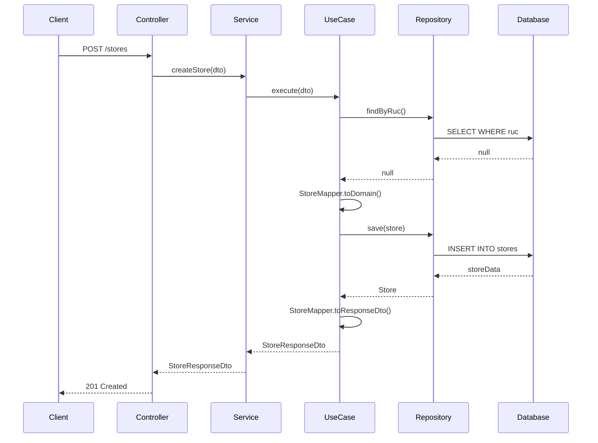
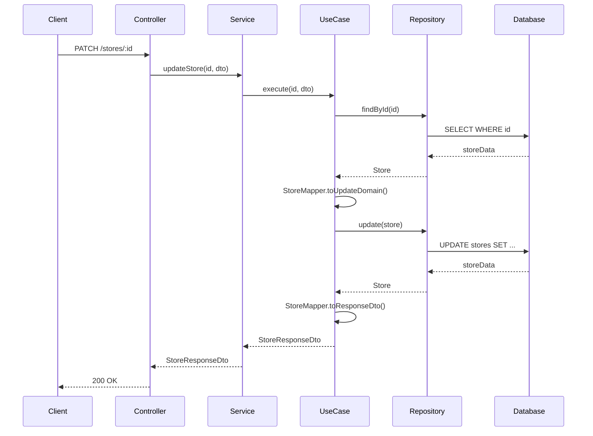
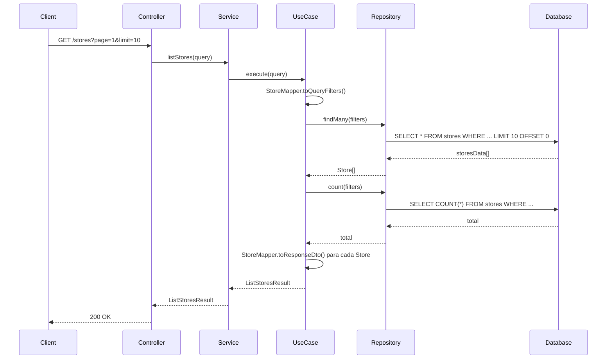
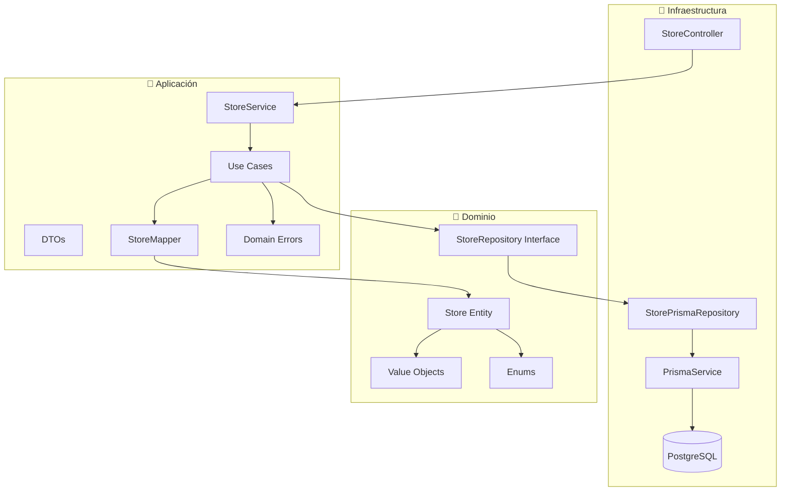

# 📋 Guía Completa de Implementación de Store en Clean Architecture

## 📖 Índice
1. [Introducción](#introducción)
2. [Arquitectura General](#arquitectura-general)
3. [Capa de Dominio](#capa-de-dominio)
4. [Capa de Aplicación](#capa-de-aplicación)
5. [Capa de Infraestructura](#capa-de-infraestructura)
6. [Flujo de Datos](#flujo-de-datos)
7. [Diagramas de Arquitectura](#diagramas-de-arquitectura)
8. [Ejemplos de Uso](#ejemplos-de-uso)
9. [Mejores Prácticas](#mejores-prácticas)

---

## 🎯 Introducción

Esta guía documenta la implementación completa del módulo **Store** siguiendo los principios de **Clean Architecture**. El módulo gestiona tiendas/empresas con validaciones robustas, manejo de estados y operaciones CRUD completas.

### Características Principales
- ✅ **Clean Architecture** con separación clara de capas
- ✅ **Value Objects** para validaciones de dominio
- ✅ **Use Cases** específicos para cada operación
- ✅ **Soft Delete** para preservar integridad de datos
- ✅ **Validaciones** robustas en todas las capas
- ✅ **Documentación API** con Swagger
- ✅ **Manejo de errores** centralizado
- ✅ **PATCH para actualizaciones parciales** (mejores prácticas REST)

---

## 🏗️ Arquitectura General

### Estructura de Capas

```
src/
├── domain/           # 🎯 Capa de Dominio (Entidades, Value Objects, Enums)
├── application/      # 🔧 Capa de Aplicación (Use Cases, Servicios, DTOs)
└── infrastructure/   # 🔌 Capa de Infraestructura (Controladores, Repositorios, DB)
```

### Principios Aplicados
- **Regla de Dependencia**: Las dependencias fluyen hacia adentro
- **Inversión de Dependencias**: Uso de interfaces y abstracciones
- **Separación de Responsabilidades**: Cada capa tiene un propósito específico
- **Encapsulación**: Lógica de negocio en entidades de dominio

---

## 🎯 Capa de Dominio

### 📁 Estructura
```
src/domain/
├── entities/
│   └── store.entity.ts          # Entidad principal
├── value-objects/
│   └── email.value-object.ts    # Validación de emails (reutilizado)
├── enums/
│   └── entity-status.enum.ts    # Estados de entidad (reutilizado)
└── repositories/
    └── store.repository.ts      # Interfaz del repositorio
```

### 🏛️ Entidad Store

**Archivo**: `src/domain/entities/store.entity.ts`

```typescript
export class Store {
  private constructor(
    private readonly _id: string,
    private _businessName: string,
    private readonly _ruc: string,
    private _legalName: string | null,
    private _address: string | null,
    private _phone: string | null,
    private _email: Email | null,
    private _logoUrl: string | null,
    private _status: EntityStatus,
    private readonly _registeredAt: Date,
    private _updatedAt: Date
  ) {}
}
```

#### Características Principales

1. **Inmutabilidad Parcial**
   - ID, RUC y fecha de registro son inmutables
   - Otros campos pueden actualizarse mediante métodos específicos

2. **Factory Methods**
   - `create()`: Para crear nuevas tiendas
   - `fromPersistence()`: Para reconstruir desde base de datos

3. **Métodos de Negocio**
   - `updateBusinessName()`, `updateAddress()`, etc.
   - `activate()`, `deactivate()`, `suspend()`, `delete()`
   - `isActive()`, `isDeleted()`

4. **Validaciones Encapsuladas**
   - Validación de RUC (11 dígitos)
   - Validación de email mediante Value Object
   - Actualización automática de `updatedAt`

### 🎯 Value Objects

#### Email Value Object (Reutilizado)
**Archivo**: `src/domain/value-objects/email.value-object.ts`

```typescript
export class Email {
  constructor(email: string) {
    this.validateEmail(email);
    this._value = email.toLowerCase().trim();
  }
}
```

**Validaciones**:
- Formato de email válido
- Máximo 254 caracteres
- Normalización automática

### 📋 Enums

#### EntityStatus (Reutilizado)
```typescript
export enum EntityStatus {
  ACTIVE = 'ACTIVE',     // Activo
  INACTIVE = 'INACTIVE', // Inactivo
  SUSPENDED = 'SUSPENDED', // Suspendido
  DELETED = 'DELETED'    // Eliminado
}
```

### 🔌 Interfaz del Repositorio

**Archivo**: `src/domain/repositories/store.repository.ts`

```typescript
export interface StoreRepository {
  findById(id: string): Promise<Store | null>;
  findByRuc(ruc: string): Promise<Store | null>;
  findByEmail(email: string): Promise<Store | null>;
  findMany(filters?: StoreQueryFilters): Promise<Store[]>;
  save(store: Store): Promise<Store>;
  update(store: Store): Promise<Store>;
  delete(id: string): Promise<void>;
  exists(id: string): Promise<boolean>;
  count(filters?: StoreQueryFilters): Promise<number>;
}
```

---

## 🔧 Capa de Aplicación

### 📁 Estructura
```
src/application/
├── use-cases/store/
│   ├── create-store.use-case.ts
│   ├── update-store.use-case.ts
│   ├── get-store-by-id.use-case.ts
│   ├── get-store-by-ruc.use-case.ts
│   ├── list-stores.use-case.ts
│   ├── change-store-status.use-case.ts
│   └── delete-store.use-case.ts
├── services/
│   └── store.service.ts
├── dto/store/
│   ├── create-store.dto.ts
│   ├── update-store.dto.ts
│   ├── store-response.dto.ts
│   ├── store-query.dto.ts
│   └── change-store-status.dto.ts
├── mappers/
│   └── store.mapper.ts
└── errors/
    └── domain-errors.ts
```

### 🎯 Use Cases

#### CreateStoreUseCase
**Archivo**: `src/application/use-cases/store/create-store.use-case.ts`

```typescript
export class CreateStoreUseCase {
  constructor(private readonly storeRepository: StoreRepository) {}

  async execute(dto: CreateStoreDto): Promise<StoreResponseDto> {
    // 1. Verificar unicidad de RUC
    const existingStore = await this.storeRepository.findByRuc(dto.ruc);
    if (existingStore) {
      throw new StoreAlreadyExistsError('RUC', dto.ruc);
    }

    // 2. Verificar unicidad de email (si se proporciona)
    if (dto.email) {
      const existingEmail = await this.storeRepository.findByEmail(dto.email);
      if (existingEmail) {
        throw new StoreAlreadyExistsError('email', dto.email);
      }
    }

    // 3. Crear entidad
    const id = crypto.randomUUID();
    const store = StoreMapper.toDomain(dto, id);

    // 4. Guardar
    const savedStore = await this.storeRepository.save(store);

    // 5. Retornar DTO
    return StoreMapper.toResponseDto(savedStore);
  }
}
```

#### UpdateStoreUseCase
**Archivo**: `src/application/use-cases/store/update-store.use-case.ts`

```typescript
export class UpdateStoreUseCase {
  async execute(id: string, dto: UpdateStoreDto): Promise<StoreResponseDto> {
    // 1. Buscar tienda existente
    const existingStore = await this.storeRepository.findById(id);
    if (!existingStore) {
      throw new StoreNotFoundError(id);
    }

    // 2. Verificar que no esté eliminada
    if (existingStore.isDeleted()) {
      throw new StoreDeletedError(id);
    }

    // 3. Verificar email único si se actualiza
    if (dto.email && dto.email !== existingStore.email?.value) {
      const existingEmail = await this.storeRepository.findByEmail(dto.email);
      if (existingEmail && existingEmail.id !== id) {
        throw new StoreAlreadyExistsError('email', dto.email);
      }
    }

    // 4. Aplicar actualizaciones
    const updatedStore = StoreMapper.toUpdateDomain(dto, existingStore);

    // 5. Guardar y retornar
    const savedStore = await this.storeRepository.update(updatedStore);
    return StoreMapper.toResponseDto(savedStore);
  }
}
```

#### ListStoresUseCase
**Archivo**: `src/application/use-cases/store/list-stores.use-case.ts`

```typescript
export class ListStoresUseCase {
  async execute(query: StoreQueryDto): Promise<ListStoresResult> {
    const filters = StoreMapper.toQueryFilters(query);
    
    // Obtener datos paginados
    const stores = await this.storeRepository.findMany(filters);
    const total = await this.storeRepository.count(filters);

    // Convertir a DTOs
    const data = stores.map(store => StoreMapper.toResponseDto(store));

    // Calcular metadatos de paginación
    const page = query.page || 1;
    const limit = query.limit || 10;
    const totalPages = Math.ceil(total / limit);

    return { data, total, page, limit, totalPages };
  }
}
```

### 🎯 Servicio de Aplicación

**Archivo**: `src/application/services/store.service.ts`

```typescript
export class StoreService {
  private readonly createStoreUseCase: CreateStoreUseCase;
  private readonly updateStoreUseCase: UpdateStoreUseCase;
  // ... otros use cases

  constructor(@Inject('StoreRepository') storeRepository: StoreRepository) {
    this.createStoreUseCase = new CreateStoreUseCase(storeRepository);
    this.updateStoreUseCase = new UpdateStoreUseCase(storeRepository);
    // ... inicializar otros use cases
  }

  async createStore(dto: CreateStoreDto): Promise<StoreResponseDto> {
    return this.createStoreUseCase.execute(dto);
  }

  async updateStore(id: string, dto: UpdateStoreDto): Promise<StoreResponseDto> {
    return this.updateStoreUseCase.execute(id, dto);
  }
  // ... otros métodos
}
```

### 📝 DTOs (Data Transfer Objects)

#### CreateStoreDto
```typescript
export class CreateStoreDto {
  @IsString()
  @MinLength(2)
  @MaxLength(100)
  businessName: string;

  @IsString()
  @Length(11, 11)
  @Matches(/^\d{11}$/, { message: 'El RUC debe tener exactamente 11 dígitos' })
  ruc: string;

  @IsOptional()
  @IsString()
  @MaxLength(100)
  legalName?: string;

  @IsOptional()
  @IsString()
  @MaxLength(255)
  address?: string;

  @IsOptional()
  @IsString()
  @MaxLength(20)
  phone?: string;

  @IsOptional()
  @IsEmail()
  @MaxLength(254)
  email?: string;

  @IsOptional()
  @IsString()
  @MaxLength(500)
  logoUrl?: string;
}
```

#### StoreResponseDto
```typescript
export class StoreResponseDto {
  @ApiProperty()
  id: string;

  @ApiProperty()
  businessName: string;

  @ApiProperty()
  ruc: string;

  @ApiPropertyOptional()
  legalName: string | null;

  @ApiPropertyOptional()
  address: string | null;

  @ApiPropertyOptional()
  phone: string | null;

  @ApiPropertyOptional()
  email: string | null;

  @ApiPropertyOptional()
  logoUrl: string | null;

  @ApiProperty({ enum: EntityStatus })
  status: EntityStatus;

  @ApiProperty()
  registeredAt: Date;

  @ApiProperty()
  updatedAt: Date;
}
```

#### StoreQueryDto
```typescript
export class StoreQueryDto {
  @IsOptional()
  @IsEnum(EntityStatus)
  status?: EntityStatus;

  @IsOptional()
  @IsString()
  @MaxLength(100)
  search?: string;

  @IsOptional()
  @Type(() => Number)
  @IsNumber()
  @Min(1)
  @Max(1000)
  page?: number;

  @IsOptional()
  @Type(() => Number)
  @IsNumber()
  @Min(1)
  @Max(100)
  limit?: number;

  @IsOptional()
  @IsString()
  @IsIn(['businessName', 'ruc', 'registeredAt', 'updatedAt'])
  sortBy?: string;

  @IsOptional()
  @IsString()
  @IsIn(['asc', 'desc'])
  sortOrder?: 'asc' | 'desc';
}
```

### 🔄 Mapper

**Archivo**: `src/application/mappers/store.mapper.ts`

```typescript
export class StoreMapper {
  // DTO → Entidad
  static toDomain(dto: CreateStoreDto, id: string): Store {
    return Store.create(
      id,
      dto.businessName,
      dto.ruc,
      dto.legalName,
      dto.address,
      dto.phone,
      dto.email,
      dto.logoUrl
    );
  }

  // Entidad → DTO de respuesta
  static toResponseDto(store: Store): StoreResponseDto {
    return {
      id: store.id,
      businessName: store.businessName,
      ruc: store.ruc,
      legalName: store.legalName,
      address: store.address,
      phone: store.phone,
      email: store.email?.value || null,
      logoUrl: store.logoUrl,
      status: store.status,
      registeredAt: store.registeredAt,
      updatedAt: store.updatedAt,
    };
  }

  // Aplicar actualizaciones a entidad existente
  static toUpdateDomain(dto: UpdateStoreDto, existingStore: Store): Store {
    if (!this.validateUpdateDto(dto)) {
      throw new Error('No hay campos válidos para actualizar');
    }

    if (dto.businessName !== undefined) {
      existingStore.updateBusinessName(dto.businessName);
    }
    if (dto.legalName !== undefined) {
      existingStore.updateLegalName(dto.legalName);
    }
    if (dto.address !== undefined) {
      existingStore.updateAddress(dto.address);
    }
    if (dto.phone !== undefined) {
      existingStore.updatePhone(dto.phone);
    }
    if (dto.email !== undefined) {
      existingStore.updateEmail(dto.email);
    }
    if (dto.logoUrl !== undefined) {
      existingStore.updateLogoUrl(dto.logoUrl);
    }

    return existingStore;
  }

  // Validar DTO de actualización
  static validateUpdateDto(dto: UpdateStoreDto): boolean {
    const fields = Object.keys(dto) as (keyof UpdateStoreDto)[];
    return fields.some(field => {
      const value = dto[field];
      return value !== undefined && value !== null && value !== '';
    });
  }
}
```

### ⚠️ Errores de Dominio

**Archivo**: `src/application/errors/domain-errors.ts`

```typescript
export abstract class DomainError extends Error {
  abstract readonly code: string;
  abstract readonly statusCode: number;
  abstract readonly isOperational: boolean;
}

export class StoreNotFoundError extends DomainError {
  readonly code = 'STORE_NOT_FOUND';
  readonly statusCode = 404;
  readonly isOperational = true;

  constructor(id: string) {
    super(`Tienda con ID ${id} no encontrada`);
  }
}

export class StoreAlreadyExistsError extends DomainError {
  readonly code = 'STORE_ALREADY_EXISTS';
  readonly statusCode = 409;
  readonly isOperational = true;

  constructor(field: string, value: string) {
    super(`Ya existe una tienda con ${field}: ${value}`);
  }
}

export class StoreDeletedError extends DomainError {
  readonly code = 'STORE_DELETED';
  readonly statusCode = 410;
  readonly isOperational = true;

  constructor(id: string) {
    super(`No se puede realizar la operación. La tienda con ID ${id} está eliminada`);
  }
}

export class InvalidRucError extends DomainError {
  readonly code = 'INVALID_RUC';
  readonly statusCode = 400;
  readonly isOperational = true;

  constructor(ruc: string) {
    super(`RUC inválido: ${ruc}. Debe tener exactamente 11 dígitos`);
  }
}
```

---

## 🔌 Capa de Infraestructura

### 📁 Estructura
```
src/infrastructure/
├── controllers/
│   └── store.controller.ts
├── repositories/
│   └── store.repository.ts
├── modules/
│   ├── store.module.ts
│   └── database.module.ts
├── database/
│   └── prisma.service.ts
└── filters/
    └── global-exception.filter.ts
```

### 🎮 Controlador

**Archivo**: `src/infrastructure/controllers/store.controller.ts`

```typescript
@ApiTags('stores')
@Controller('stores')
export class StoreController {
  constructor(private readonly storeService: StoreService) {}

  @Post()
  @HttpCode(HttpStatus.CREATED)
  @ApiOperation({ summary: 'Crear una nueva tienda' })
  @ApiResponse({ status: 201, description: 'Tienda creada exitosamente' })
  async createStore(@Body() createStoreDto: CreateStoreDto): Promise<StoreResponseDto> {
    return this.storeService.createStore(createStoreDto);
  }

  @Get(':id')
  @ApiOperation({ summary: 'Obtener tienda por ID' })
  @ApiParam({ name: 'id', description: 'ID único de la tienda' })
  async getStoreById(@Param('id') id: string): Promise<StoreResponseDto | null> {
    return this.storeService.getStoreById(id);
  }

  @Get('ruc/:ruc')
  @ApiOperation({ summary: 'Obtener tienda por RUC' })
  @ApiParam({ name: 'ruc', description: 'RUC de la tienda' })
  async getStoreByRuc(@Param('ruc') ruc: string): Promise<StoreResponseDto | null> {
    return this.storeService.getStoreByRuc(ruc);
  }

  @Get()
  @ApiOperation({ summary: 'Listar tiendas con filtros y paginación' })
  async listStores(@Query() query: StoreQueryDto): Promise<ListStoresResult> {
    return this.storeService.listStores(query);
  }

  @Patch(':id')
  @ApiOperation({ summary: 'Actualizar datos de una tienda (actualización parcial)' })
  @ApiParam({ name: 'id', description: 'ID único de la tienda' })
  @ApiResponse({ status: 200, description: 'Tienda actualizada exitosamente' })
  @ApiResponse({ status: 400, description: 'Datos de entrada inválidos' })
  @ApiResponse({ status: 404, description: 'Tienda no encontrada' })
  @ApiResponse({ status: 409, description: 'Ya existe una tienda con el mismo email' })
  async updateStore(
    @Param('id') id: string,
    @Body() updateStoreDto: UpdateStoreDto,
  ): Promise<StoreResponseDto> {
    return this.storeService.updateStore(id, updateStoreDto);
  }

  @Put(':id/status')
  @ApiOperation({ summary: 'Cambiar estado de una tienda' })
  @ApiParam({ name: 'id', description: 'ID único de la tienda' })
  async changeStoreStatus(
    @Param('id') id: string,
    @Body() changeStatusDto: ChangeStoreStatusDto,
  ): Promise<StoreResponseDto> {
    return this.storeService.changeStoreStatus(id, changeStatusDto);
  }

  @Delete(':id')
  @HttpCode(HttpStatus.NO_CONTENT)
  @ApiOperation({ summary: 'Eliminar una tienda (soft delete)' })
  async deleteStore(@Param('id') id: string): Promise<void> {
    return this.storeService.deleteStore(id);
  }
}
```

### 🗄️ Repositorio de Infraestructura

**Archivo**: `src/infrastructure/repositories/store.repository.ts`

```typescript
@Injectable()
export class StorePrismaRepository implements StoreRepository {
  constructor(private readonly prisma: PrismaService) {}

  async findById(id: string): Promise<Store | null> {
    const storeData = await this.prisma.store.findUnique({
      where: { id },
    });

    if (!storeData) {
      return null;
    }

    return Store.fromPersistence(
      storeData.id,
      storeData.businessName,
      storeData.ruc,
      storeData.legalName,
      storeData.address,
      storeData.phone,
      storeData.email,
      storeData.logoUrl,
      storeData.status as EntityStatus,
      storeData.registeredAt,
      storeData.updatedAt
    );
  }

  async findByRuc(ruc: string): Promise<Store | null> {
    const storeData = await this.prisma.store.findUnique({
      where: { ruc },
    });

    if (!storeData) {
      return null;
    }

    return Store.fromPersistence(/* ... */);
  }

  async findMany(filters: StoreQueryFilters): Promise<Store[]> {
    const where: any = {};

    if (filters.status) {
      where.status = filters.status;
    }

    if (filters.search) {
      where.OR = [
        { businessName: { contains: filters.search, mode: 'insensitive' } },
        { ruc: { contains: filters.search } },
        { legalName: { contains: filters.search, mode: 'insensitive' } },
      ];
    }

    const storesData = await this.prisma.store.findMany({
      where,
      skip: filters.offset || 0,
      take: filters.limit || 10,
      orderBy: {
        [filters.sortBy || 'registeredAt']: filters.sortOrder || 'desc',
      },
    });

    return storesData.map(storeData =>
      Store.fromPersistence(/* ... */)
    );
  }

  async save(store: Store): Promise<Store> {
    const storeData = await this.prisma.store.create({
      data: {
        id: store.id,
        businessName: store.businessName,
        ruc: store.ruc,
        legalName: store.legalName,
        address: store.address,
        phone: store.phone,
        email: store.email?.value || null,
        logoUrl: store.logoUrl,
        status: store.status,
        registeredAt: store.registeredAt,
        updatedAt: store.updatedAt,
      },
    });

    return Store.fromPersistence(/* ... */);
  }

  async update(store: Store): Promise<Store> {
    const storeData = await this.prisma.store.update({
      where: { id: store.id },
      data: {
        businessName: store.businessName,
        legalName: store.legalName,
        address: store.address,
        phone: store.phone,
        email: store.email?.value || null,
        logoUrl: store.logoUrl,
        status: store.status,
        updatedAt: store.updatedAt,
      },
    });

    return Store.fromPersistence(/* ... */);
  }

  async delete(id: string): Promise<void> {
    await this.prisma.store.update({
      where: { id },
      data: { status: EntityStatus.DELETED },
    });
  }

  async exists(id: string): Promise<boolean> {
    const count = await this.prisma.store.count({
      where: { id },
    });
    return count > 0;
  }

  async count(filters: StoreQueryFilters): Promise<number> {
    const where: any = {};

    if (filters.status) {
      where.status = filters.status;
    }

    if (filters.search) {
      where.OR = [
        { businessName: { contains: filters.search, mode: 'insensitive' } },
        { ruc: { contains: filters.search } },
        { legalName: { contains: filters.search, mode: 'insensitive' } },
      ];
    }

    return this.prisma.store.count({ where });
  }
}
```

### 🏗️ Módulos

#### StoreModule
**Archivo**: `src/infrastructure/modules/store.module.ts`

```typescript
@Module({
  controllers: [StoreController],
  providers: [
    StoreService,
    PrismaService,
    {
      provide: 'StoreRepository',
      useClass: StorePrismaRepository,
    },
  ],
  exports: [StoreService, 'StoreRepository'],
})
export class StoreModule {}
```

---

## 🔄 Flujo de Datos

### 1. Crear Tienda



### 2. Actualizar Tienda



### 3. Listar Tiendas



---

## 📊 Diagramas de Arquitectura

### Arquitectura de Capas



---

## 🚀 Ejemplos de Uso

### 1. Crear una Tienda

```bash
curl -X POST http://localhost:9987/stores \
  -H "Content-Type: application/json" \
  -d '{
    "businessName": "Mi Tienda de Tecnología",
    "ruc": "20123456789",
    "legalName": "Mi Tienda de Tecnología S.A.C.",
    "address": "Av. Principal 123, Lima, Perú",
    "phone": "+51987654321",
    "email": "contacto@mitienda.com"
  }'
```

**Respuesta**:
```json
{
  "id": "123e4567-e89b-12d3-a456-426614174000",
  "businessName": "Mi Tienda de Tecnología",
  "ruc": "20123456789",
  "legalName": "Mi Tienda de Tecnología S.A.C.",
  "address": "Av. Principal 123, Lima, Perú",
  "phone": "+51987654321",
  "email": "contacto@mitienda.com",
  "logoUrl": null,
  "status": "ACTIVE",
  "registeredAt": "2024-01-15T10:30:00.000Z",
  "updatedAt": "2024-01-15T10:30:00.000Z"
}
```

### 2. Listar Tiendas con Filtros

```bash
curl "http://localhost:9987/stores?page=1&limit=10&status=ACTIVE&search=tecnología"
```

**Respuesta**:
```json
{
  "data": [
    {
      "id": "123e4567-e89b-12d3-a456-426614174000",
      "businessName": "Mi Tienda de Tecnología",
      "ruc": "20123456789",
      "legalName": "Mi Tienda de Tecnología S.A.C.",
      "address": "Av. Principal 123, Lima, Perú",
      "phone": "+51987654321",
      "email": "contacto@mitienda.com",
      "logoUrl": null,
      "status": "ACTIVE",
      "registeredAt": "2024-01-15T10:30:00.000Z",
      "updatedAt": "2024-01-15T10:30:00.000Z"
    }
  ],
  "total": 1,
  "page": 1,
  "limit": 10,
  "totalPages": 1
}
```

### 3. Actualizar Tienda (Actualización Parcial)

```bash
curl -X PATCH http://localhost:9987/stores/123e4567-e89b-12d3-a456-426614174000 \
  -H "Content-Type: application/json" \
  -d '{
    "businessName": "Mi Tienda de Tecnología Actualizada",
    "address": "Av. Principal 456, Lima, Perú"
  }'
```

### 4. Cambiar Estado

```bash
curl -X PUT http://localhost:9987/stores/123e4567-e89b-12d3-a456-426614174000/status \
  -H "Content-Type: application/json" \
  -d '{
    "status": "INACTIVE",
    "reason": "Solicitud del administrador"
  }'
```

### 5. Eliminar Tienda (Soft Delete)

```bash
curl -X DELETE http://localhost:9987/stores/123e4567-e89b-12d3-a456-426614174000
```

---

## ✅ Mejores Prácticas

### 1. **Validaciones por Capas**
- **Dominio**: Validaciones de negocio en entidades y value objects
- **Aplicación**: Validaciones de casos de uso específicos
- **Infraestructura**: Validaciones de entrada con class-validator

### 2. **Manejo de Errores**
- Errores de dominio específicos y descriptivos
- Códigos de error consistentes
- Filtro global para manejo centralizado

### 3. **Inmutabilidad**
- Value objects inmutables
- Entidades con campos inmutables donde corresponde
- Factory methods para creación controlada

### 4. **Separación de Responsabilidades**
- Cada use case tiene una responsabilidad específica
- Mappers para conversión entre capas
- Servicios como orquestadores de use cases

### 5. **Testabilidad**
- Interfaces para repositorios
- Inyección de dependencias
- Métodos pequeños y enfocados

### 6. **Documentación**
- Swagger para API
- Comentarios en código
- Guías de implementación

### 7. **PATCH para Actualizaciones Parciales**
- Uso semánticamente correcto de PATCH
- Mejor rendimiento de red
- Actualizaciones granulares por campo

---

## 🔧 Configuración de Base de Datos

### Schema Prisma

```prisma
model Store {
  id                String   @id @default(uuid())
  businessName      String   @map("business_name")
  ruc               String   @unique
  legalName         String?  @map("legal_name")
  address           String?
  phone             String?
  email             String?
  logoUrl           String?  @map("logo_url")
  status            EntityStatus @default(ACTIVE)
  registeredAt      DateTime @default(now()) @map("registered_at")
  updatedAt         DateTime @updatedAt @map("updated_at")

  @@index([status])
  @@map("stores")
}

enum EntityStatus {
  ACTIVE
  INACTIVE
  SUSPENDED
  DELETED
}
```

### Migración

```sql
-- CreateTable
CREATE TABLE "stores" (
    "id" TEXT NOT NULL,
    "business_name" TEXT NOT NULL,
    "ruc" TEXT NOT NULL,
    "legal_name" TEXT,
    "address" TEXT,
    "phone" TEXT,
    "email" TEXT,
    "logo_url" TEXT,
    "status" "EntityStatus" NOT NULL DEFAULT 'ACTIVE',
    "registered_at" TIMESTAMP(3) NOT NULL DEFAULT CURRENT_TIMESTAMP,
    "updated_at" TIMESTAMP(3) NOT NULL,

    CONSTRAINT "stores_pkey" PRIMARY KEY ("id")
);

-- CreateIndex
CREATE UNIQUE INDEX "stores_ruc_key" ON "stores"("ruc");

-- CreateIndex
CREATE INDEX "stores_status_idx" ON "stores"("status");
```

---

## 📈 Métricas y Monitoreo

### Endpoints Disponibles

| Método | Endpoint | Descripción |
|--------|----------|-------------|
| POST | `/stores` | Crear tienda |
| GET | `/stores/:id` | Obtener tienda por ID |
| GET | `/stores/ruc/:ruc` | Obtener tienda por RUC |
| GET | `/stores` | Listar tiendas con filtros |
| PATCH | `/stores/:id` | Actualizar tienda (actualización parcial) |
| PUT | `/stores/:id/status` | Cambiar estado |
| DELETE | `/stores/:id` | Eliminar tienda (soft delete) |

### Códigos de Error

| Código | Descripción |
|--------|-------------|
| `STORE_NOT_FOUND` | Tienda no encontrada |
| `STORE_ALREADY_EXISTS` | Tienda ya existe |
| `STORE_DELETED` | Tienda eliminada |
| `INVALID_RUC` | RUC inválido |
| `INVALID_EMAIL` | Email inválido |
| `INVALID_STATUS_CHANGE` | Cambio de estado inválido |

---

## 🎯 Conclusión

Esta implementación de Store en Clean Architecture demuestra:

1. **Separación clara de responsabilidades** entre capas
2. **Validaciones robustas** en cada nivel
3. **Manejo de errores** centralizado y consistente
4. **Testabilidad** alta gracias a la inversión de dependencias
5. **Mantenibilidad** excelente por la organización modular
6. **Escalabilidad** para futuras funcionalidades
7. **Mejores prácticas REST** con PATCH para actualizaciones parciales

La arquitectura permite agregar nuevas funcionalidades sin afectar las capas existentes, manteniendo la integridad del sistema y facilitando el desarrollo y mantenimiento del código.

---

*Documentación generada automáticamente - Backend Inventory System*
